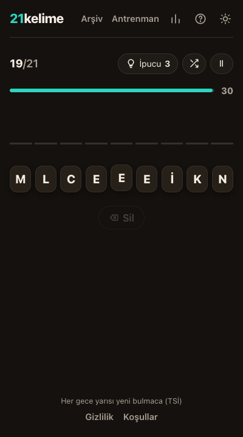
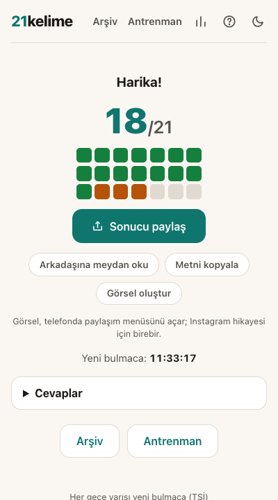

# 21kelime

Günlük Türkçe kelime oyunu. Her gün 21 tur; her turda karışık harflerden, tüm harfleri kullanarak geçerli bir kelime bulmaya çalışırsın. Süre dolmadan!

|             Oyun              |              Sonuç              |
| :---------------------------: | :-----------------------------: |
|  |  |

## Oyun

- Günde **21 tur**, kelimeler gittikçe uzar: 3 tane 4 harfli, 4'er tane 5, 6 ve 7 harfli, 3'er tane 8 ve 9 harfli.
- Her tur **30 saniye**. Süre dolarsa tur yanar ama oyun devam eder; skorun X/21 olarak hesaplanır.
- Günde **3 ipucu** hakkın var; ipucu, cevabın sıradaki harfini yerine koyar.
- Aynı harflerle yazılabilen **her sözlük kelimesi** doğru sayılır (eczane ile cenaze, hayır ile hıyar gibi).
- **Rahat mod** süresiz oynatır; paylaşımda ay işaretiyle görünür.
- Geçmiş günler **Arşiv**'de, sınırsız pratik **Antrenman**'da. Seri ve istatistikler cihazında tutulur.
- Yeni bulmaca her gece yarısı Türkiye saatiyle yayınlanır; gün 1 = 2026-07-12 (`EPOCH_DATE`, [src/lib/game/daily.ts](src/lib/game/daily.ts)).

## Teknik yapı

- **SvelteKit 2 + Svelte 5 (runes)**, TypeScript, Vite 8, Vitest 4. Cloudflare Workers üzerinde çalışır.
- Sözlük verisi yalnızca sunucuda durur; istemciye günün turları, cevaplar hafifçe şifrelenmiş halde gider. Gelecek günler istenirse 404 döner.
- Bulmacalar deterministiktir: kelime havuzları derleme sırasında sabit bir tohumla karıştırılır, gün numarası havuzları dilimler. Veritabanı yoktur, herkes aynı bulmacayı görür.
- Türkçe'ye özgü ayrıntılar: bütün harf işlemleri `tr-TR` locale ile yapılır (İ/i ve I/ı ayrımı), şapkalı ünlüler sadeleştirilir (kâr = kar), klavye girişi hem Q hem F düzeninde çalışır.

## Geliştirme

```bash
npm install
npm run dev            # http://localhost:5173
npm test               # birim testleri
npm run check          # typecheck
npm run lint           # prettier + eslint
```

### Kelime verisi

Kaynaklar: Zemberek-NLP sözlükleri (TDK madde başları) ve FrequencyWords sıklık listesi. Yeniden üretmek için:

```bash
./scripts/fetch-data.sh           # ham verileri indirir
npm run build:words               # words.json üretir
npm run build:words -- --report   # havuz istatistikleriyle
```

[data/blocklist.txt](data/blocklist.txt) günlük hedef olamayacak kelimeleri listeler; cevap olarak yine kabul edilirler.

**Önemli:** Havuz sıralaması `POOL_SHUFFLE_SEED` tohumuna bağlıdır. Kelime verisini ya da tohumu değiştirmek, gelecek günlerin tamamının bulmacasını değiştirir. Yayındayken veri güncellemesini bilinçli yap ve tohum sürümünü artır.

### Uçtan uca testler

Gerçek Chrome ile oynayarak test eder:

```bash
npm run build && npm run preview   # 4173 portunda
npm run test:e2e                   # ayrı terminalde
```

## Yayınlama (Cloudflare Workers)

```bash
npm run build
npx wrangler deploy
```

Analitik için Cloudflare panelinden Web Analytics'i açman yeterli; alan adı Cloudflare üzerinden geçtiği için beacon otomatik eklenir. Çerezsizdir, onay bandı gerektirmez.

## Lisans ve atıf

- Kod: MIT.
- Kelime verileri: [Zemberek-NLP](https://github.com/ahmetaa/zemberek-nlp) sözlükleri (Apache-2.0) ve [FrequencyWords](https://github.com/hermitdave/FrequencyWords) (MIT).
- Oyun fikri, [18words.com](https://18words.com)'dan ilham alınarak Türkçe için sıfırdan tasarlandı ve yazıldı.
