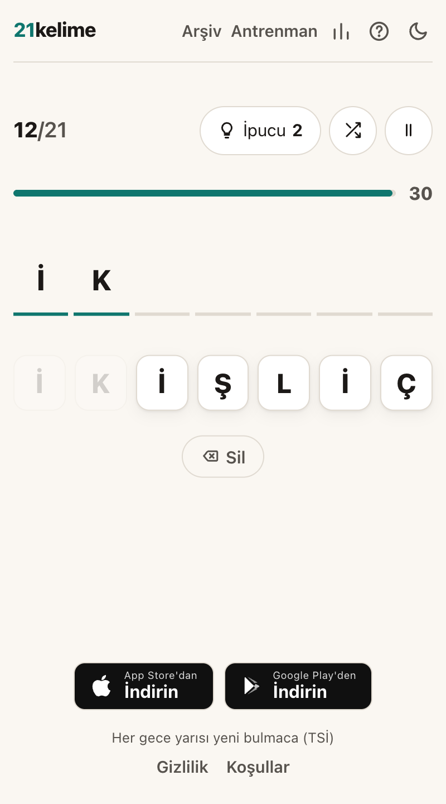
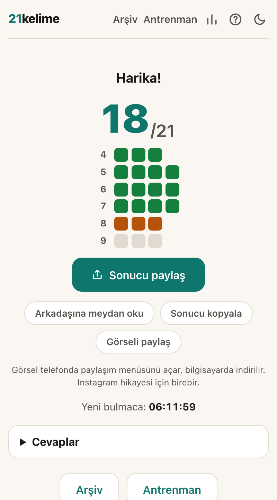

# 21kelime

Günlük Türkçe kelime oyunu. Her gün 21 tur: süre dolmadan, karışık harflerin hepsini kullanıp geçerli bir kelime bulmalısın.

|             Oyun              |              Sonuç              |
| :---------------------------: | :-----------------------------: |
|  |  |

## Nasıl oynanır?

- Günde **21 tur** var. Kelimeler kısa başlar, gittikçe uzar: ilk turlar 4 harfli, son turlar 9 harfli.
- Her turun süresi **30 saniye**. Süre biterse o tur yanar, oyun sonraki turla devam eder; gün sonunda skorun X/21 olur.
- Günde **3 ipucu** hakkın var. İpucu, cevabın sıradaki harfini senin yerine koyar.
- Aynı harflerle yazılabilen **bütün sözlük kelimeleri** kabul edilir: cevap elmas diye selam yazdıysan o da doğrudur.
- Aceleyi sevmiyorsan **rahat modu** aç: süre yok, takıldığın turu geçebilirsin. Paylaşımda "rahat mod" etiketi görünür, gizli saklı yok.
- Sonucunu spoiler'sız emoji kartıyla paylaşabilir, hikaye boyutunda görsel indirebilir, arkadaşına meydan okuyabilirsin.
- Kaçırdığın günler **Arşiv**'de seni bekler; bol alıştırma için **Antrenman** var (her seferinde yeni kelimeler). Seri ve istatistikler yalnızca kendi cihazında tutulur.
- Açık ve koyu tema var; oyun klavyeyle de dokunmatik ekranla da rahatça oynanır.
- Yeni bulmaca her gece yarısı Türkiye saatiyle yayınlanır. Birinci gün 2026-07-13; bu tarihi [src/lib/game/daily.ts](src/lib/game/daily.ts) içindeki `EPOCH_DATE` belirler.

## Nasıl çalışır?

- **SvelteKit 2 + Svelte 5 (runes)**, TypeScript, Vite 8, Vitest 4. Cloudflare Workers üzerinde çalışır.
- Sözlük istemciye hiç gitmez. Tarayıcıya yalnızca günün turları iner, cevaplar da hafifçe şifrelenmiştir. Yarının bulmacasını isteyen 404 alır.
- Bulmacalar deterministiktir: kelime havuzları derleme sırasında sabit bir tohumla bir kez karıştırılır, her gün havuzdan sırayla çekilir. Veritabanı yoktur; dünyanın neresinde olursan ol herkes aynı bulmacayı çözer.
- En hassas kısım Türkçe'nin kendisi: bütün harf işlemleri `tr-TR` locale ile yapılır (İ/i ve I/ı ayrımı), şapkalı harfler sadeleştirilir (kâr = kar), klavye girişi hem Q hem F düzeninde çalışır.

## Geliştirme

```bash
npm install
npm run dev            # http://localhost:5173
npm test               # birim testleri
npm run check          # tip denetimi
npm run lint           # prettier + eslint
```

### Kelime verisi

Kelimeler iki açık kaynaktan alınmıştır: Zemberek-NLP sözlükleri (TDK madde başlıkları) ve FrequencyWords sıklık listesi. Veriyi yeniden üretmek istersen:

```bash
./scripts/fetch-data.sh           # ham verileri indirir, sıklık listesini sadeleştirir
node scripts/verify-tdk.ts        # yeni adayları TDK'de doğrular (önbelleğe yazar)
npm run build:words               # words.json'ı üretir
npm run build:words -- --report   # havuz istatistiklerini de gösterir
```

Sıklık listesi 2 milyon satırlık `tr_full.txt` olarak inip [scripts/reduce-frequency.ts](scripts/reduce-frequency.ts) ile sözlükte karşılığı olan satırlara indirgenir; depoda yalnızca 290 KB'lık `tr_freq.txt` durur.

Günlük bulmacada çıkmasını istemediğin kelimeleri [data/blocklist.txt](data/blocklist.txt) dosyasına ekleyebilirsin; oyuncu yazarsa yine kabul edilir, sadece soru olarak sorulmaz.

#### Havuzlara yalnızca ekleme yapılır

Gün N, `pools[len]` dizisinden sabit bir konumdan dilim alır: **dizinin içeriği yayındaki bulmaca takviminin ta kendisidir.** Bir kelimeyi çıkarmak ya da sırayı değiştirmek, oynanmış günleri geriye dönük değiştirir; üstelik uygulamalar bulmacayı kendi içlerindeki kopyadan hesapladığı için, çevrimdışı bir cihaza kelimelerin yer değiştirdiği haber verilemez.

Sona eklemek güvenlidir: eski uzunluğun altındaki her konum aynı kelimeyi vermeye devam eder, yani eski ve yeni veri, eski havuz başa saracağı güne kadar bütün günlerde birebir aynı bulmacayı üretir.

Kurallar:

1. `words.json` içinde bulunan bir kelimeyi **asla** çıkarma ya da yerini değiştirme; sadece sona ekle. [scripts/build-words.ts](scripts/build-words.ts) bunu her derlemede doğrular ve ihlalde hata verir.
2. Her veri değişikliğinde `DATA_VERSION`'ı artır. Çevrimiçi uygulamalar `/data-version.json` ile karşılaştırıp farklıysa bulmacayı sunucudan ister.
3. Sona eklenen her kelimenin TDK'de madde başı olması gerekir: sonuç ekranı her cevabı sozluk.gov.tr'ye bağlar, karşılığı olmayan kelime kırık bağlantı demektir. Doğrulama sonuçları `data/tdk-verified.json` içinde önbelleğe alınır ve depoya girer, böylece derleme çevrimdışı ve deterministik kalır.

### Uçtan uca testler

Gerçek Chrome açıp oyunu baştan sona oynar:

```bash
npm run build && npm run preview   # 4173 portunda çalışır
npm run test:e2e                   # ayrı bir terminalde
```

Playwright, US klavye düzeninde olmayan ç/ğ/ı/ö/ş/ü harflerini `keyboard.type()` ile üretemez (keydown olayı hiç doğmaz), bu yüzden [scripts/e2e-helpers.ts](scripts/e2e-helpers.ts) bu harfleri karolara tıklayarak girer. Testler CI'da her push'ta koşar.

## Yayınlama

Cloudflare Workers'a yayınlamak için tek komut yeter (derlemeyi wrangler kendisi çalıştırır):

```bash
npx wrangler deploy
```

GitHub'a bağlayıp otomatik dağıtım da kurabilirsin: Cloudflare panelinde Workers → Import a repository de, gerisini [wrangler.jsonc](wrangler.jsonc) halleder. Ziyaretçi sayıları için panelden Web Analytics'i açman yeterli; alan adı Cloudflare'dan geçtiği için kod tarafında hiçbir şey gerekmez, çerez de kullanılmaz.

## Lisans ve atıf

- Kod: MIT.
- Kelime verileri: [Zemberek-NLP](https://github.com/ahmetaa/zemberek-nlp) sözlükleri (Apache-2.0) ve [FrequencyWords](https://github.com/hermitdave/FrequencyWords) (MIT).
- Oyun, [18words.com](https://18words.com)'dan ilham alınarak Türkçe için sıfırdan tasarlandı ve yazıldı.
